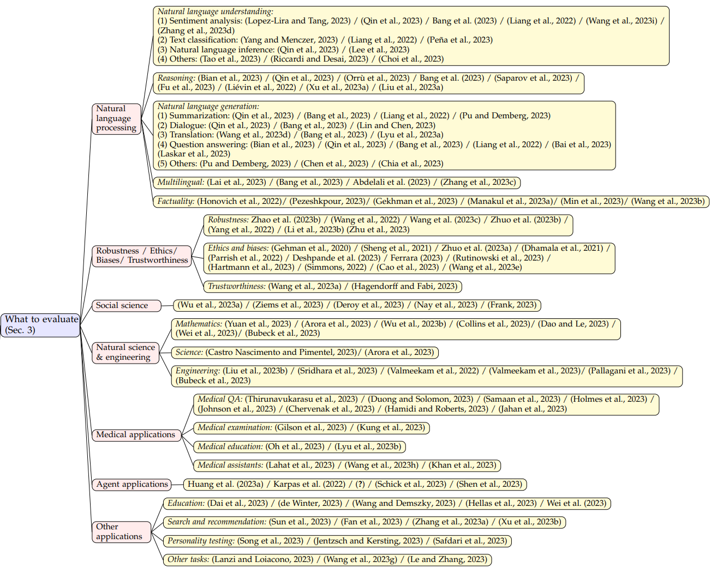

<h1 align="center">
   
  
</h1>

大型语言模型（LLMs）在学术界和工业界备受青睐，因为它们在各种应用中展现出前所未有的性能。然而，随着LLMs在研究和实际应用中的广泛使用，对其进行评估变得越来越重要。
本文介绍LLMs评估领域的第一篇综述文章《A Survey on Evaluation of Large Language Models》。
该论文一共调研了219篇文献。文章以评估对象、评估方法和评估挑战等几大方面对LLMs的评估进进行了详细的概括和总结。

### 文章信息
> 文章链接：https://doi.org/10.48550/arXiv.2307.03109   
> PDF：https://doi.org/10.48550/arXiv.2307.03109                                                                                                                       
> Github链接：https://github.com/MLGroupJLU/LLM-eval-survey                                                                                                                  
> 作者单位：吉林大学、微软亚洲研究院等

## 文章结构
本文是对大型语言模型（LLMs）评价的首次全面调查。通过图1所示的框架，我们从三个方面对现有工作进行了探索：

(1) 评价内容(What to evaluate？)，总结了目前LLMs的评估任务;

(2) 评价领域(Where to evaluate？)，总结了如何选择合适的数据集和基准进行评估;

(3) 评价方法(How to evaluate？)，总结了如何对给定任务和数据集进行评估的具体过程。这三个维度对于LLMs的评估是不可或缺的。

最后，我们讨论了LLMs评价领域可能面临的未来挑战。

## 怎么评价（What to evaluate）
在评估大型语言模型（LLMs）的性能时，选择合适的任务和领域对于展示它们的表现、优势和劣势至关重要。本文将现有的任务划分为不同的类别，
包括自然语言处理任务、伦理与偏见、医学应用、社会科学、自然科学与工程任务、代理应用（使用LLMs作为代理）以及其他领域。
通过对这些任务的评估，我们可以更全面地了解LLMs的能力和局限性。

## 在哪里评价（Where to evaluate）
我们通过深入探讨评测基准来回答Where to evaluate？的问题，如下图所示，评测基准主要分为通用基准（General benchmarks）和具体基准（Specific benchmarks）通用基准

随着LLMs基准测试的不断发展，我们目前可以看到许多受欢迎的基准测试。在下表中，我们总结了18个流行的基准测试，每个都关注不同的方面和评估标准，为各自的领域提供了有价值的贡献。

## 如何评价（How to evaluate）
我们通过深入探讨评估方法来回答How to evaluate？的问题，在本节中，我们将介绍两种常用的评价方法：自动评价和人工评价。这两种方法在评估语言模型和机器翻译等任务时起着重要的作用。
自动评价方法基于计算机算法和自动生成的指标，能够快速且高效地评估模型的性能。而人工评价则侧重于人类专家的主观判断和质量评估，能够提供更深入、细致的分析和意见。
了解和掌握这两种评价方法对于我们准确评估和改进语言模型的能力至关重要。

## 总结（Summary）

## 重大挑战（Grand challenges）
评估作为一门新学科:我们对llm评估的总结激励我们重新设计广泛的方面。在本节中，我们将介绍几个重大挑战。我们的重点是，评估应该被视为推动llm和其他人工智能模型成功的基本学科。
现有的研究方案不足以对llm进行全面的评估，这可能为未来的llm评估研究带来新的机遇。

我们的调查显示，目前的llm在许多任务中都存在一定的局限性，尤其是推理和健壮性任务。与此同时，对当代评估系统进行调整和发展的需求依然明显，以确保对llm的内在能力和局限性进行准确评估。
我们确定了未来研究应该解决的几个重大挑战，并希望llm能够逐步提高他们对人类的服务。

