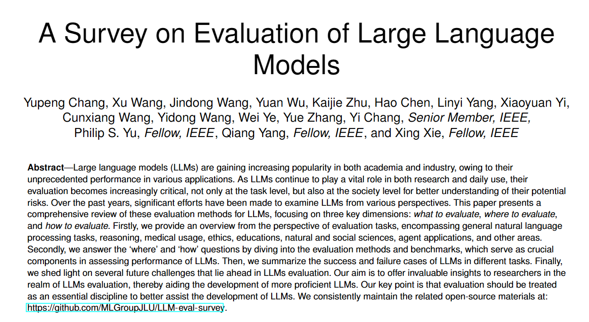
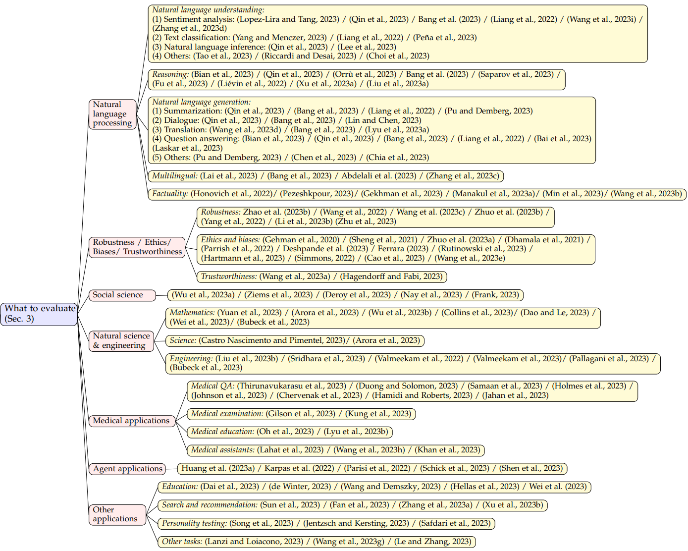
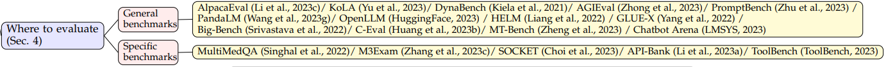
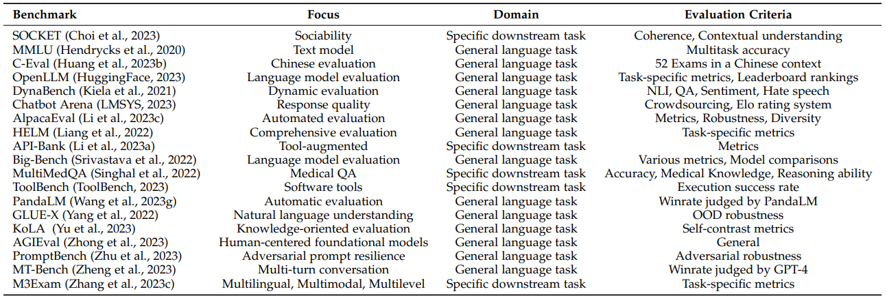
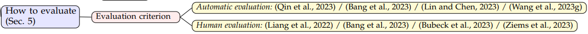
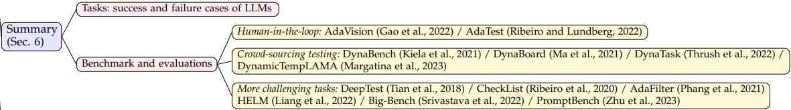
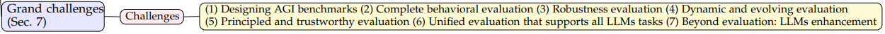

<h1 align="center">
   
  
</h1>

大型语言模型（LLMs）因其在学术界和工业界展现出前所未有的性能而备受青睐。然而，随着LLMs在研究和实际应用中的广泛使用，对其进行有效评估变得愈发重要。
本文介绍LLMs评估领域的第一篇综述文章《A Survey on Evaluation of Large Language Models》。
该论文一共调研了219篇文献。文章首次以**评估对象、评估领域、评估方法和目前的评估挑战**等几大方面对LLMs的评估进进行了详细的概括和总结。
我们的目标是增强对LLMs当前状态的理解，阐明它们的优势和局限性，并为未来LLMs的发展提供见解。

### 文章信息
> 文章链接：https://doi.org/10.48550/arXiv.2307.03109   
> PDF：https://doi.org/10.48550/arXiv.2307.03109                                                                                                                       
> Github链接：https://github.com/MLGroupJLU/LLM-eval-survey                                                                                                                  
> 作者单位：吉林大学、微软亚洲研究院等

## 文章结构
本文是对大型语言模型（LLMs）评价的首次全面调查。通过图1所示的框架，我们从三个方面对现有工作进行了探索：

(1) 评估内容(What to evaluate？)，对海量的LLMs评估任务进行分类并总结评估结果；

(2) 评估领域(Where to evaluate？)，对LLMs评估常用的数据集和基准进行了总结；

(3) 评估方法(How to evaluate？)，总结了目前流行的两种LLMs评估方法。

这三个维度对于LLMs的评估是不可或缺的。最后，我们讨论了LLMs评估时可能面临的巨大挑战(Grand challenges)。

## 评价什么（What to evaluate）
本文的主要目的是总结和讨论目前在大型语言模型上的评估工作。在评估大型语言模型（LLMs）的性能时，选择合适的任务和领域对于展示它们的表现、优势和劣势至关重要。为了更清晰地展示LLMs的能力水平，本文将现有的任务划分为以下不同的类别：

1. 自然语言处理：包括自然语言理解、推理、自然语言生成和多语言任务。
2. 鲁棒性、伦理、偏见和真实性。
3. 医学应用：包括医学问答、医学考试、医学教育和医学助手。
4. 社会科学。
5. 自然科学与工程：包括数学、通用科学和工程。
6. 代理应用：使用LLMs作为代理。
7. 其他应用。

这样的分类方式能够更好地展示LLMs在各领域的表现。需要注意的是，几个NLP领域有交叉点，因此我们的这些领域的分类只是一种可能的分类方式。

在每个类别中，我们综合了目前关于LLMs的评测文章，并进行了详细总结。通过对LLMs的成功和失败案例进行深入分析，我们得出了有深思熟虑的结论，为未来的研究提供了宝贵的经验。

## 在哪里评价（Where to evaluate）
我们通过深入探讨评测基准来回答Where to evaluate？的问题，如下图所示，评测基准主要分为通用基准（General benchmarks）和具体基准（Specific benchmarks）。

随着LLMs基准测试的不断发展，我们目前可以看到许多受欢迎的基准测试。在下表中，我们总结了19个流行的基准测试，每个都关注不同的方面和评估标准，为各自的领域提供了有价值的贡献。

## 如何评价（How to evaluate）
我们通过深入探讨评估方法来回答How to evaluate？的问题，在本节中，我们将介绍两种常用的评价方法：自动评价和人工评价。这两种方法在评估语言模型和机器翻译等任务时起着重要的作用。
自动评价方法基于计算机算法和自动生成的指标，能够快速且高效地评估模型的性能。而人工评价则侧重于人类专家的主观判断和质量评估，能够提供更深入、细致的分析和意见。
了解和掌握这两种评价方法对于我们准确评估和改进语言模型的能力至关重要。

## 总结（Summary）
在这一部分，我们总结了LLMs在不同任务中的成功和失败案例。
LLMs在生成流畅准确的文本、语言理解任务中的出色表现、生成具有上下文理解能力的连贯回答以及在多个自然语言处理任务中的可称赞性能等方面表现出色，但也存在偏见和不准确性、理解复杂逻辑和推理任务的能力限制、处理大规模数据集和长期记忆的挑战、对实时或动态信息的局限性、对提示敏感以及在文本摘要领域特定评估指标下可能的不佳表现。

## 重大挑战（Grand challenges）
评估作为一门新学科:我们对LLMs评估的总结激励我们重新设计广泛的方面。在本节中，我们将介绍几个重大挑战。我们的重点是，评估应该被视为推动LLMs和其他人工智能模型成功的基本学科。
现有的研究方案不足以对LLMs进行全面的评估，这可能为未来的LLMs评估研究带来新的机遇。

评估具有深远的意义，在人工智能模型的发展中变得势在必行，尤其是在大型语言模型的背景下。本文首次从评价什么、如何评价、在哪里评价三个方面对法学硕士的评价进行了全面的概述。通过封装评估任务、协议和基准，我们的目标是增强对LLMs当前状态的理解，阐明它们的优势和局限性，并为未来LLMs的发展提供见解。

我们的调查显示，目前的LLMs在许多任务中都存在一定的局限性，尤其是推理和健壮性任务。与此同时，对当代评估系统进行调整和发展的需求依然明显，以确保对LLMs的内在能力和局限性进行准确评估。
我们确定了未来研究应该解决的几个重大挑战，并希望LLMs能够逐步提高他们对人类的服务。

